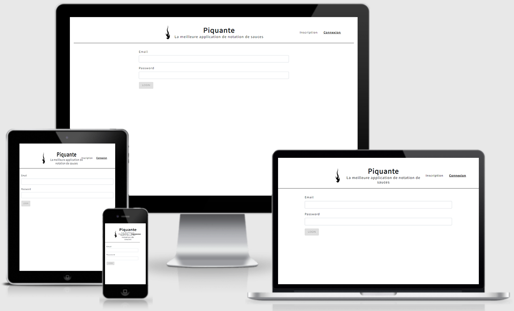

# Projet n°5 : Construire une API sécurisée pour une application d'avis gastronomiques

## :mag: Aperçu

## :bookmark_tabs: Sommaire
<ol>
    <li><a href="#sujet">Sujet</a></li>
    <li><a href="#demandes_respecter">Demandes à respecter</a></li>
    <li><a href="#objectifs_projet">Objectifs du projet</a></li>
    <li><a href="#technologies_utilisees">Technologies utilisées</a></li>
    <li><a href="#prerequis">Prérequis</a></li>
    <li><a href="#installation">Installation</a></li>
    <li><a href="#utilisation_siteweb">Utilisation du site web</a></li>
    <li><a href="#auteurs_contributeurs">Auteurs et contributeurs</a></li>
    <li><a href="#licence">Licence</a></li>
</ol>

## :page_facing_up: 1. Sujet 

Vous êtes développeur backend freelance et vous travaillez depuis quelques années sur des projets web pour des startups ou des grandes entreprises.

La semaine dernière, vous avez reçu un mail vous proposant un nouveau projet.

La marque So Pekocko, qui crée des sauces piquantes, connaît un franc succès, en partie grâce à sa chaîne de vidéos YouTube “La piquante”.

L’entreprise souhaite désormais développer une application d’évaluation de ses sauces piquantes, appelée “Piquante”.

Même si l’application deviendra peut-être un magasin en ligne dans un futur proche, Sophie, la product owner de So Pekocko, a décidé que le MVP du projet sera une application web permettant aux utilisateurs d’ajouter leurs sauces préférées et de liker ou disliker les sauces ajoutées par les autres utilisateurs.

## :memo: 2. Demandes à respecter 

* Utiliser des pratiques de code sécurisées.
* Les données personnelles des utilisateurs doivent être protégées, que ce soit côté API, que côté base de données, grâce à des méthodes de masquage.
* L'API doit respecter les standards OWASP.
* Le projet doit être hébergé par un serveur Node.js.
* La base de données utilisée doit être MongoDB.
* Utiliser le framework Express.js.
* Utiliser le plug-in Mongoose pour garantir que toutes les erreurs de la base de données soient signalées.
* L'API doit fonctionner parfaitement avec le frontend.

## :checkered_flag: 3. Objectifs du projet 

* Apprendre à utiliser Node.js, Express.js, MongoDB, et Mongoose.
* Implémenter un modèle logique de données conformément à la réglementation.
* Stocker des données de manière sécurisée.
* Mettre en œuvre des opérations CRUD de manière sécurisée.

## :computer: 4. Technologies utilisées 

* HTML
* CSS
* JavaScript
* TypeScript
* Angular
* Node.js
* Express.js
* MongoDB
* Mongoose
* Git & GitHub

## :exclamation: 5. Prérequis 

* NodeJS en version 12.14 ou 14.0.
* Angular CLI en version 7.0.2.
* Node-sass : attention à prendre la version correspondante à NodeJS. Pour Node 14.0 par exemple, installer node-sass en version 4.14+.
* Sur Windows, ces installations nécessitent d'utiliser PowerShell en tant qu'administrateur.

## :wrench: 6. Installation 

* Cloner ce repository.
* Dans un terminal, depuis le dossier backend, exécuter npm install.
* Toujours dans le terminal, depuis le dossier frontend, exécuter npm install.

## :question: 7. Utilisation du site web 

* Dans le terminal, depuis le dossier backend, écrire "nodemon server" pour lancer le serveur.
* Dans un nouveau terminal, écrire "ng serve" pour lancer la partie front.
* Se rendre sur http://localhost:4200/.

## :beers: 8. Auteurs et Contributeurs 

Timoté Lancelle : [GitHub](https://github.com/LancelleTimote) / [LinkedIn](https://www.linkedin.com/in/timote-lancelle-devweb/)

## :page_with_curl: 9. Licence 

Distribué sous la licence MIT. Voir le fichier [LICENSE](LICENSE) pour plus d'informations.